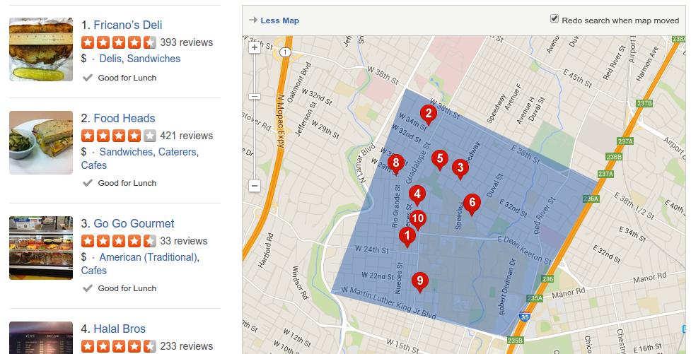
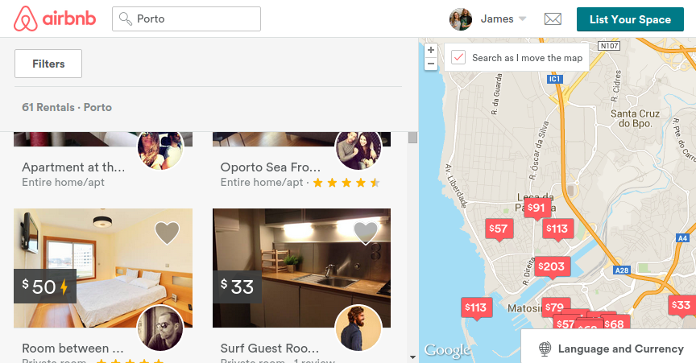
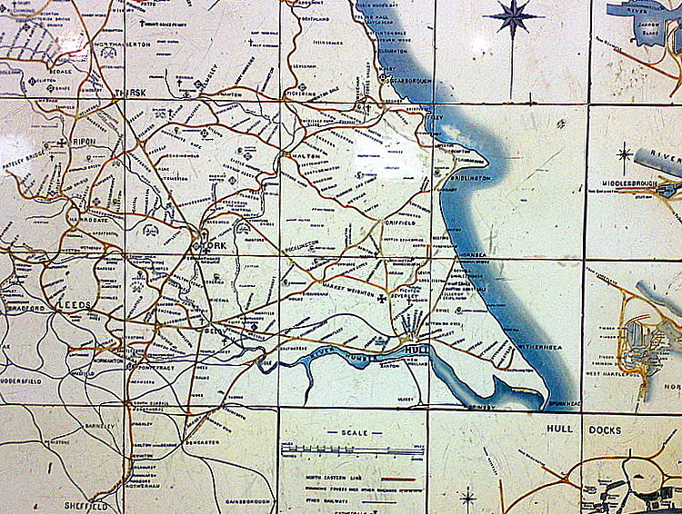

% Basics of Online Maps
% James Seppi
% August 4, 2015

-------------------------------------------------

# Basics of Online Maps

Presentation by James Seppi

Software Developer at [TNRIS](http://tnris.org), part of [TWDB](http://www.twdb.texas.gov)

Twitter: [hydrologee](http://twitter.com/hydrologee)

Viewable at [jseppi.github.io/intro-to-web-maps/](http://jseppi.github.io/intro-to-web-maps/)

Source code at [github.com/jseppi/intro-to-web-maps/](https://github.com/jseppi/intro-to-web-maps/)

# What is an Online Map?

# What is an <s>Online</s> Map?

<h1>What is a Web Map?</h1>

# What is a Web Map?

A cartographic map on a web page

. . .

Can move around (pan) and zoom in and out

. . .

Like [Google Maps](https://www.google.maps/com)

. . .

And also maps from [Bing](https://www.bing.com/maps/), [MapQuest](http://mapquest.com), [ESRI](http://www.arcgis.com/home/webmap/viewer.html?useExisting=1), [Mapbox](http://mapbox.com), [Stamen](http://maps.stamen.com/#terrain/12/37.7706/-122.3782), [CartoDB](https://cartodb.com/), etc. 

# What is a Web Map?

Typically streets or satellite imagery

](img/bing-satellite.png)

# What is a Web Map?

Sometimes with additional data overlaid

](img/tt-reservoirlevels.png)

# What is a Web Map?

Found everywhere these days:

. . .

News sites, food review sites, travel booking sites, data explorers, etc.

----------------------------

</img>

----------------------------

</img>

----------------------------

</img>

----------------------------

</img>

# Why do we care?

(TODO: Motivation for why we care about maps)

Maps are a valuable tool for communication

Power in communication

By being capable or at least literate, you can challenge the communication of others

# Why do we care?

# Some History

**MapQuest** in 1996

. . .

(TODO: MapQuest Image)

. . .

Driving directions, on the Internet, printable

. . .

WHOA!

----------------------

# But it was a little slow

(though so was everything online back then)

. . .

. . .

Required a full page refresh to pan or zoom

Tiny Turtle: <a href="https://creativecommons.org/licenses/by-nc-nd/2.0/">CC BY-NC-ND</a>, <a href="https://www.flickr.com/photos/angelskiss31/2472924279/in/photolist-4Lwoev-4TtUqF-ej1p5c-9QVYJB-8B26At-9HKwZ3-rFtkZG-eaLgPs-GhBE4-6vYZp7-71C2A1-9xgbxG-9XPdm-6bqCZa-7Nvxw1-7NryV6-7NvxuG-7NvxrW-8MafHa-6ToUFF-3YKG8-LNtRp-LB2z2-7GJ8B-6niyEU-bug2ir-bie9k2-8nKry-61aWfe-4Q4vnQ-6tDL2L-bTSsNK-7TBreS-49WKWA-54sPet-dFMMHy-aFhfhD-4gRfAc-aFhffM-5L6RAA-5JKQdj-PM62L-5JKQ7o-5JKQad-37qLkZ-efBnyK-83oh7Z-f4ZvM6-oj3orM-7gAnPv">Source</a>

# Some History

9 years later, in early 2005

. . .

Google Maps!

. . .

(TODO: Early Google Maps GIF)

. . .

Fluid, continuous panning and zooming

---------------------

</img>

---------------------

# Tile Technology

. . .

Alhambra Tiles 7: <a href="https://creativecommons.org/licenses/by/2.0/">CC BY</a>, <a href="https://www.flickr.com/photos/robven/3142024214/in/photolist-5MDGkh-95VRZ-ouVA1-66KGDn-qaotmE-onLhdx-6SX2m6-o9KdDb-nSSTGi-pWcepA-aHtBsF-63q5Xt-h2uRRu-bCQDqi-q9CxTN-qcJQVD-5ZCkiG-hqa5CH-En8XK-qdFEjA-4P8bvg-63YJGV-pVFte6-qdoGfB-hgGiZJ-meVoK-pV85k6-69HBqj-PR9cQ-5MDGa3-4PeYHz-8Pgm3g-9vumGC-6RsTYt-4zGa4t-3tpASM-6kbcGU-hqb8fT-qaVW8N-5MzsxP-bkkE5P-q4G6Lm-pMvun-6Y3sM9-38aYez-4gu2oJ-6de9B-3Cmxni-5Mzs8p-afCky">Source</a>

# Tile Technology

NER Tile Map segment Beverley: <a href="https://creativecommons.org/licenses/by-nc-nd/2.0/">CC BY-NC-ND</a>, <a href="https://www.flickr.com/photos/johngreyturner/394625304/in/photolist-ASymy-ASyJo-ASyDz-ASyvX-bQtmfa-oXsQHL-eYgmQJ-btgqpB-9MK1RC-nDZjmy-7eTCVD-9uPfUD-9sCzr9-tdZEa5-te84EX-tteNmQ-syKbNR-tvhyFb-syKd46-te84op-tdZD7d-syyBm1-tdYrT1-tdYtGw-nE1iek-nWtvja-9L7DUS-9uBpnm-nWopSs-nYg6x2-nDZztu-nDZywu-9wb1AR-au9Dmy-9uyoRM-nWorCb-nYfYKV-9E55Ms-syKcBp-nWbnNt-tdYuC9-ttePZQ-tvhx3S-nDZPZU-nYg6TT-nWox6A-nDZJ1E-nDZgKd-ac8kwZ-2gEMXi">Source</a>

# Tile Technology

(TODO: this slide)

256 x 256 pixel images

Zoom levels

(TODO: Gif of tiles loading)

(TODO: Gif of same tile from multiple maps)

# Making Your Own Web Map

[Google Maps API](https://developers.google.com/maps/?hl=en)

. . .

[Bing Maps API](https://www.microsoft.com/maps/choose-your-bing-maps-API.aspx)

[ESRI JavaScript API](https://developers.arcgis.com/javascript/)

[OpenLayers](http://openlayers.org/)

. . .

[Leaflet](http://leafletjs.com/) (Personal Favorite)

# But those all require programming

----------------------------

</img>

----------------------------

# CartoDB

[CartoDB](http://cartodb.com) is an online service for geospatial data visualizations

. . .

Or as most people call them, "maps"

. . . 

Built on [PostGIS](http://postgis.net) and [PostgreSQL](http://postgresql.org)

Easily import data from a variety of formats (spreadsheets, shapefiles, KML)

Visualize the data in a web map with presets or customized options

Perform simple or complex analyses

Free for up 50 MB of (converted) data - pretty generous!

# CartoDB

Sign up at [cartodb.com/signup](https://cartodb.com/signup) for today's exercises

# Exercise 1 - Simple Points

[Natural Earth Data - naturalearthdata.com](http://www.naturalearthdata.com/)

This is a great resource for general cartographic data, and it's public domain!

# Exercise 1 - Simple Points

(TODO: Goal Picture)

1. Download [Natural Earth Data Populated Places](http://www.naturalearthdata.com/downloads/50m-cultural-vectors/50m-populated-places/) dataset: [goo.gl/JqPle5](http://goo.gl/JqPle5)

1. Whatever

something else

# Exercise 2 - Polygons

Maybe census tracts in Austin with jobs data?

# Exercise 3 - Your Own Data Exploration

Places for data

- Austin GIS Data

- ESRI Open Data http://opendata.arcgis.com/

- CartoDB Data Repository

-

# Local Geo Groups

Austin Open Source GIS User Group

[meetup.com/atx-osg](http://www.meetup.com/atx-osg)

[meetup.com/MaptimeATX](http://www.meetup.com/MaptimeATX)

# Credits

* [Maptime Anatomy of a Web Map](http://maptime.io/anatomy-of-a-web-map/)